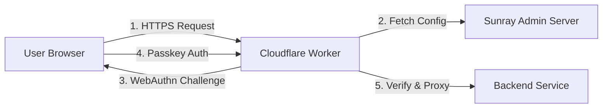
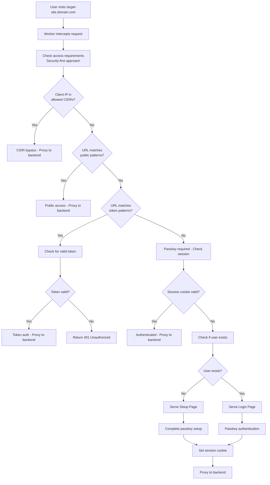

# Muppy Sunray Worker v3 Specification - WebAuthn with Passkeys

## 🌞 Overview

> **Prerequisites**: Read the [Sunray Introduction](../sunray_introduction.md) for core concepts and authentication flow.

The **Muppy Sunray Worker** is the `Cloudflare Worker` component that implements the authentication logic described in the introduction. This specification covers the technical implementation details.

**Available in two editions:**
- **Sunray (Free)**: Core authentication with manual `Setup Token` delivery
- **Sunray Advanced (Paid)**: Enhanced with automation, advanced policies, and enterprise integrations

## 🏗️ Architecture



## 🔐 Technical Implementation Flow

> **Note**: For the conceptual flow, see the [Introduction](../sunray_introduction.md#-authentication-flow). This section covers implementation details.



### Implementation Details

**Request Processing Priority Order:**

**1. CIDR Check:**
```javascript
if (isIPInCIDR(clientIP, host.allowed_cidrs)) {
  return proxyToBackend(request, { type: 'cidr_bypass', ip: clientIP });
}
```

**2. URL Pattern Matching:**
```javascript
// Public patterns (no auth)
if (matchesPattern(urlPath, host.public_url_patterns)) {
  return proxyToBackend(request, { type: 'public' });
}

// Token patterns (token auth)
if (matchesPattern(urlPath, host.token_url_patterns)) {
  return handleTokenAuth(request, host);
}
```

**3. Session Validation:**
```javascript
const sessionCookie = getCookie(request, 'sunray_session');
const sessionData = await SESSIONS.get(`session:${sessionCookie}`);
if (sessionData && isValidSession(sessionData)) {
  return proxyToBackend(request, { type: 'passkey', ...sessionData });
}
```

**4. Authentication Pages:**
```javascript
const userExists = await checkUserExists(username);
if (!userExists) {
  return serveSetupPage();  // New user registration
} else {
  return serveLoginPage();  // Existing user login
}
```

## 📋 Worker Endpoints

### Primary Endpoint

| Path | Method | Description |
|------|--------|-------------|
| `/*` | ALL | **Main intercept endpoint** - handles all requests with unified flow |

The Worker intercepts all requests to the protected domain and determines the appropriate response:
- **Valid session** → Proxy to backend
- **New user** → Serve setup page 
- **Existing user** → Serve login page

### Internal API Endpoints

| Path | Method | Description |
|------|--------|-------------|
| `/sunray-wrkr/v1/setup/validate` | POST | Validate setup token and store user |
| `/sunray-wrkr/v1/setup/register` | POST | Complete WebAuthn registration |
| `/sunray-wrkr/v1/auth/challenge` | POST | Get WebAuthn authentication challenge |
| `/sunray-wrkr/v1/auth/verify` | POST | Verify passkey assertion and create session |
| `/sunray-wrkr/v1/auth/logout` | POST | Clear session cookie |

### Admin Endpoints

| Path | Method | Description |
|------|--------|-------------|
| `/sunray-wrkr/v1/admin/cache/invalidate` | POST | Force configuration cache refresh |
| `/sunray-wrkr/v1/admin/health` | GET | Health check and status endpoint |

**Note**: All Sunray Worker internal endpoints use the `/sunray-wrkr/v1/` prefix for API versioning and to avoid conflicts with backend application routes and Admin Server APIs.

## 🔧 Implementation Details

### Main Request Handler

```javascript
export default {
  async fetch(request, env, ctx) {
    try {
      const url = new URL(request.url);
      
      // Handle Sunray internal endpoints
      if (url.pathname.startsWith('/sunray-wrkr/v1/')) {
        return handleSunrayEndpoint(request, env, ctx);
      }
      
      // Main unified authentication flow
      return handleUnifiedFlow(request, env, ctx);
      
    } catch (error) {
      console.error('Worker error:', error);
      return new Response('Internal Server Error', { status: 500 });
    }
  }
};

async function handleUnifiedFlow(request, env, ctx) {
  const url = new URL(request.url);
  const config = await getConfig();
  const host = findHostConfig(config, request.url);
  
  if (!host) {
    // Domain not configured - reject
    return new Response('Domain not configured', { status: 404 });
  }
  
  // 1. Determine access requirements (security-first approach)
  const clientIP = request.headers.get('CF-Connecting-IP');
  const accessRequirement = determineAccessRequirement(clientIP, url.pathname, host);
  
  if (accessRequirement === 'cidr_allowed') {
    // CIDR exception - bypass all authentication
    return proxyToBackend(request, { type: 'cidr_bypass', ip: clientIP }, host, env);
  }
  
  if (accessRequirement === 'public') {
    // Public URL exception - no authentication required
    return proxyToBackend(request, { type: 'public' }, host, env);
  }
  
  if (accessRequirement === 'token') {
    // Token URL exception - check for token authentication
    const tokenAuth = await checkTokenAuth(request, host, env);
    if (tokenAuth.valid) {
      return proxyToBackend(request, { type: 'token', ...tokenAuth }, host, env);
    } else {
      return new Response('Unauthorized - Valid token required', { status: 401 });
    }
  }
  
  // 2. Default case: Passkey authentication required
  // Check for existing session cookie
  const sessionCookie = getCookie(request, 'sunray_session');
  
  if (sessionCookie) {
    const sessionData = await env.SESSIONS.get(`session:${sessionCookie}`);
    if (sessionData) {
      const session = JSON.parse(sessionData);
      
      // Validate session policies  
      if (validateSessionPolicy(request, session, host)) {
        // Valid session - proxy to backend
        return proxyToBackend(request, { type: 'passkey', ...session }, host, env);
      }
    }
  }
  
  // 3. No valid session - serve authentication pages
  const userIdentifier = extractUserIdentifier(request, host);
  const userExists = await checkUserExists(userIdentifier, env);
  
  if (!userExists) {
    // New user - serve setup page
    return serveSetupPage(request, host);
  } else {
    // Existing user - serve login page
    return serveLoginPage(request, host, userIdentifier);
  }
}

function determineAccessRequirement(clientIP, urlPath, host) {
  /**
   * Determine access requirements using security-first whitelist approach
   * Default: Everything requires passkey authentication
   * 
   * Returns:
   * - 'cidr_allowed': Client IP is in allowed CIDR blocks
   * - 'public': URL matches public pattern exception
   * - 'token': URL matches token pattern exception  
   * - 'passkey': Default - passkey authentication required
   */
  
  // 1. Check CIDR exceptions (highest priority)
  if (clientIP && host.allowed_cidrs) {
    for (const cidr of host.allowed_cidrs) {
      if (isIPInCIDR(clientIP, cidr)) {
        return 'cidr_allowed';
      }
    }
  }
  
  // 2. Check public URL exceptions
  if (host.public_url_patterns) {
    for (const pattern of host.public_url_patterns) {
      if (new RegExp(pattern).test(urlPath)) {
        return 'public';
      }
    }
  }
  
  // 3. Check token URL exceptions
  if (host.token_url_patterns) {
    for (const pattern of host.token_url_patterns) {
      if (new RegExp(pattern).test(urlPath)) {
        return 'token';
      }
    }
  }
  
  // 4. Default: Require passkey authentication
  return 'passkey';
}

function isIPInCIDR(ip, cidr) {
  /**
   * Check if IP address is within CIDR block
   * Simple implementation for Worker environment
   */
  try {
    const [network, prefixLength] = cidr.split('/');
    const prefix = parseInt(prefixLength, 10);
    
    // Convert IP addresses to 32-bit integers
    const ipToInt = (ip) => {
      return ip.split('.').reduce((int, octet) => (int << 8) + parseInt(octet, 10), 0) >>> 0;
    };
    
    const ipInt = ipToInt(ip);
    const networkInt = ipToInt(network);
    const mask = (-1 << (32 - prefix)) >>> 0;
    
    return (ipInt & mask) === (networkInt & mask);
  } catch (error) {
    console.error('CIDR check error:', error);
    return false;
  }
}

async function checkTokenAuth(request, host, env) {
  /**
   * Check for token authentication via header or URL parameter
   */
  const url = new URL(request.url);
  let token = null;
  
  // Check URL parameter first
  if (host.webhook_param_name) {
    token = url.searchParams.get(host.webhook_param_name);
  }
  
  // Check header if no URL parameter
  if (!token && host.webhook_header_name) {
    token = request.headers.get(host.webhook_header_name);
  }
  
  if (!token) {
    return { valid: false, reason: 'No token provided' };
  }
  
  // Find matching token in host configuration
  const validToken = host.webhook_tokens?.find(t => t.token === token);
  
  if (!validToken) {
    return { valid: false, reason: 'Invalid token' };
  }
  
  // Check IP restrictions if configured
  const clientIP = request.headers.get('CF-Connecting-IP');
  if (validToken.allowed_ips?.length > 0 && !validToken.allowed_ips.includes(clientIP)) {
    return { valid: false, reason: 'IP not allowed' };
  }
  
  // Check expiration
  if (validToken.expires_at && new Date(validToken.expires_at) < new Date()) {
    return { valid: false, reason: 'Token expired' };
  }
  
  // Update usage tracking via Admin Server (async, don't wait)
  trackWebhookUsage(token, clientIP, env).catch(console.error);
  
  return {
    valid: true,
    tokenName: validToken.name,
    token: token
  };
}

async function trackWebhookUsage(token, clientIP, env) {
  /**
   * Track webhook token usage via Admin Server
   */
  try {
    await fetch(`${env.ADMIN_API_ENDPOINT}/sunray-srvr/v1/webhooks/track-usage`, {
      method: 'POST',
      headers: {
        'Authorization': `Bearer ${env.ADMIN_API_KEY}`,
        'Content-Type': 'application/json'
      },
      body: JSON.stringify({
        token,
        client_ip: clientIP,
        timestamp: new Date().toISOString()
      })
    });
  } catch (error) {
    console.error('Failed to track webhook usage:', error);
  }
}

function extractUserIdentifier(request, host) {
  // Extract user identifier from subdomain, header, or other configured method
  const url = new URL(request.url);
  
  if (host.user_identification === 'subdomain') {
    return url.hostname.split('.')[0];
  }
  
  if (host.user_identification === 'header') {
    return request.headers.get(host.user_header || 'X-Username');
  }
  
  // Default: prompt for username in setup/login
  return null;
}

async function checkUserExists(userIdentifier, env) {
  if (!userIdentifier) return false;
  
  try {
    const response = await fetch(`${env.ADMIN_API_ENDPOINT}/sunray-srvr/v1/users/check`, {
      method: 'POST',
      headers: {
        'Authorization': `Bearer ${env.ADMIN_API_KEY}`,
        'Content-Type': 'application/json'
      },
      body: JSON.stringify({ username: userIdentifier })
    });
    
    if (response.ok) {
      const result = await response.json();
      return result.exists;
    }
  } catch (error) {
    console.error('Error checking user existence:', error);
  }
  
  return false;
}

function serveSetupPage(request, host) {
  return new Response(SETUP_HTML, {
    headers: {
      'Content-Type': 'text/html',
      'Cache-Control': 'no-cache, no-store, must-revalidate'
    }
  });
}

function serveLoginPage(request, host, userIdentifier) {
  const loginHtml = LOGIN_HTML.replace('{{USERNAME}}', userIdentifier || '');
  return new Response(loginHtml, {
    headers: {
      'Content-Type': 'text/html',
      'Cache-Control': 'no-cache, no-store, must-revalidate'
    }
  });
}

function getCookie(request, name) {
  const cookies = request.headers.get('Cookie');
  if (!cookies) return null;
  
  const match = cookies.match(new RegExp(`(?:^|;\\s*)${name}=([^;]*)`));
  return match ? match[1] : null;
}
```

### Environment Variables

```javascript
// Required
const ADMIN_API_ENDPOINT = env.ADMIN_API_ENDPOINT; // https://admin.muppy.cloud
const ADMIN_API_KEY = env.ADMIN_API_KEY;           // Bearer token
const SUNRAY_EDITION = env.SUNRAY_EDITION || 'free'; // 'free' or 'advanced'

// Optional with defaults
const SESSION_DURATION = env.SESSION_DURATION || 28800;     // 8 hours (fixed in free)
const CACHE_DURATION = env.CACHE_DURATION || 300;           // 5 minutes
const CHALLENGE_TIMEOUT = env.CHALLENGE_TIMEOUT || 120;     // 2 minutes
const RP_ID = env.RP_ID || "sunray.muppy.cloud";           // Relying party ID
const RP_NAME = env.RP_NAME || "Muppy Sunray";             // Display name
```

### KV Namespaces

```javascript
// Bindings in wrangler.toml
[[kv_namespaces]]
binding = "SESSIONS"
id = "session-store-id"

[[kv_namespaces]]
binding = "CHALLENGES"
id = "challenge-store-id"

[[kv_namespaces]]
binding = "CONFIG_CACHE"
id = "config-cache-id"
```

### Configuration Fetching

```javascript
async function getConfig(forceRefresh = false) {
  if (!forceRefresh) {
    // Check cache first
    const cached = await env.CONFIG_CACHE.get('config');
    if (cached) {
      return JSON.parse(cached);
    }
  }
  
  // Fetch from Admin Server
  const response = await fetch(`${ADMIN_API_ENDPOINT}/sunray-srvr/v1/config`, {
    headers: {
      'Authorization': `Bearer ${ADMIN_API_KEY}`,
      'X-Worker-ID': env.WORKER_ID
    }
  });
  
  if (!response.ok) {
    throw new Error(`Config fetch failed: ${response.status}`);
  }
  
  const config = await response.json();
  
  // Cache with TTL
  await env.CONFIG_CACHE.put(
    'config',
    JSON.stringify(config),
    { expirationTtl: CACHE_DURATION }
  );
  
  return config;
}
```

### WebAuthn Registration Options

```javascript
function getRegistrationOptions(user) {
  return {
    challenge: generateRandomBuffer(32),
    rp: {
      id: RP_ID,
      name: RP_NAME
    },
    user: {
      id: new TextEncoder().encode(user.username),
      name: user.username,
      displayName: user.display_name || user.username
    },
    pubKeyCredParams: [
      { alg: -7, type: "public-key" },   // ES256 (preferred)
      { alg: -257, type: "public-key" }  // RS256 (fallback)
    ],
    authenticatorSelection: {
      residentKey: "required",
      requireResidentKey: true,
      userVerification: "required"
    },
    timeout: CHALLENGE_TIMEOUT * 1000,
    attestation: "none"
  };
}
```

### WebAuthn Authentication Options

```javascript
function getAuthenticationOptions() {
  return {
    challenge: generateRandomBuffer(32),
    rpId: RP_ID,
    userVerification: "required",
    timeout: CHALLENGE_TIMEOUT * 1000
    // No allowCredentials - browser shows all available passkeys
  };
}
```

### Edition Feature Detection

```javascript
// Feature availability based on edition
const FEATURES = {
  // Always available (Free + Advanced)
  passkey_auth: true,
  basic_sessions: true,
  audit_logging: true,
  user_management: true,
  unlimited_servers: true,
  admin_users: true,
  basic_monitoring: true,
  read_only_api: true,
  
  // Advanced edition only
  advanced_sessions: isAdvanced(),
  mfa_totp: isAdvanced(),
  emergency_access: isAdvanced(),
  rate_limiting: isAdvanced(),
  security_alerts: isAdvanced(),
  compliance_reports: isAdvanced(),
  bulk_operations: isAdvanced(),
  self_service_portal: isAdvanced(),
  full_api_access: isAdvanced(),
  saml_oidc: isAdvanced(),
  hr_sync: isAdvanced(),
  chat_integrations: isAdvanced(),
  advanced_monitoring: isAdvanced()
};

function isAdvanced() {
  return SUNRAY_EDITION === 'advanced';
}

function requiresAdvanced(feature) {
  if (!FEATURES[feature]) {
    throw new Error(`Feature '${feature}' requires Sunray Advanced`);
  }
}
```

### Session Management

```javascript
// Get session duration based on edition and policies
function getSessionDuration(host, user) {
  if (FEATURES.advanced_sessions) {
    // Advanced: Use host or user-specific durations
    return host.session_duration_override || 
           user.default_session_duration || 
           SESSION_DURATION;
  }
  // Free: Fixed 8 hours
  return 28800;
}

// Check advanced session policies
function validateSessionPolicy(request, sessionData, host) {
  if (!FEATURES.advanced_sessions) {
    // Free edition: basic IP check only
    const currentIP = request.headers.get('CF-Connecting-IP');
    return sessionData.ip === currentIP;
  }
  
  // Advanced: Enhanced validation
  const currentIP = request.headers.get('CF-Connecting-IP');
  const policies = host.session_policies || {};
  
  // IP binding policy
  if (policies.strict_ip_binding && sessionData.ip !== currentIP) {
    return false;
  }
  
  // Device trust level
  if (policies.require_trusted_device && !sessionData.deviceTrusted) {
    return false;
  }
  
  return true;
}

async function createSession(username, credentialId, request, host) {
  const sessionId = generateRandomId();
  const duration = getSessionDuration(host, { username });
  
  const sessionData = {
    username,
    credentialId,
    createdAt: Date.now(),
    ip: request.headers.get('CF-Connecting-IP'),
    userAgent: request.headers.get('User-Agent'),
    deviceTrusted: FEATURES.advanced_sessions ? await checkDeviceTrust(credentialId) : true
  };
  
  await env.SESSIONS.put(
    `session:${sessionId}`,
    JSON.stringify(sessionData),
    { expirationTtl: duration }
  );
  
  return sessionId;
}

function getSessionCookie(sessionId, duration) {
  return `sunray_session=${sessionId}; Domain=${RP_ID}; Path=/; Secure; HttpOnly; SameSite=Lax; Max-Age=${duration}`;
}
```

### Rate Limiting (Advanced Only)

```javascript
async function checkRateLimit(request, username) {
  if (!FEATURES.rate_limiting) {
    return { allowed: true }; // No rate limiting in free edition
  }
  
  const ip = request.headers.get('CF-Connecting-IP');
  const now = Date.now();
  const windowMs = 60000; // 1 minute window
  
  // Per-user rate limiting
  const userKey = `rate:user:${username}:${Math.floor(now / windowMs)}`;
  const userCount = await env.RATE_LIMIT.get(userKey) || 0;
  
  if (parseInt(userCount) >= 30) { // 30 requests per minute per user
    return { allowed: false, reason: 'User rate limit exceeded' };
  }
  
  // Per-IP rate limiting
  const ipKey = `rate:ip:${ip}:${Math.floor(now / windowMs)}`;
  const ipCount = await env.RATE_LIMIT.get(ipKey) || 0;
  
  if (parseInt(ipCount) >= 100) { // 100 requests per minute per IP
    return { allowed: false, reason: 'IP rate limit exceeded' };
  }
  
  // Increment counters
  await env.RATE_LIMIT.put(userKey, (parseInt(userCount) + 1).toString(), { expirationTtl: windowMs / 1000 });
  await env.RATE_LIMIT.put(ipKey, (parseInt(ipCount) + 1).toString(), { expirationTtl: windowMs / 1000 });
  
  return { allowed: true };
}
```

### Request Proxying

```javascript
async function proxyToBackend(request, authData, host, env) {
  const backendUrl = host.backend.replace(/\/$/, '') + new URL(request.url).pathname + new URL(request.url).search;
  
  // Rate limiting check (Advanced only) - skip for public/webhook access
  if (authData && authData.username) {
    const rateLimitResult = await checkRateLimit(request, authData.username);
    if (!rateLimitResult.allowed) {
      return new Response('Rate limit exceeded', { 
        status: 429,
        headers: { 'Retry-After': '60' }
      });
    }
  }
  
  // Clone request with backend URL
  const proxyRequest = new Request(backendUrl, request);
  
  // Add headers based on authentication type
  const headers = new Headers(proxyRequest.headers);
  
  // Common headers
  headers.set('X-Sunray-Edition', env.SUNRAY_EDITION);
  headers.set('X-Sunray-Access-Type', authData?.type || 'unknown');
  
  switch (authData?.type) {
    case 'cidr_bypass':
      // CIDR bypass - IP was in allowed range
      headers.set('X-Sunray-Bypass-Reason', 'allowed_cidr');
      headers.set('X-Sunray-Client-IP', authData.ip);
      break;
      
    case 'public':
      // Public URL exception - no authentication required
      headers.set('X-Sunray-Bypass-Reason', 'public_url');
      break;
      
    case 'token':
      // Token authentication
      headers.set('X-Sunray-Token-Name', authData.tokenName || 'unknown');
      headers.set('X-Sunray-Authenticated', 'token');
      break;
      
    case 'passkey':
      // User passkey authentication
      headers.set('X-Sunray-User', authData.username || '');
      headers.set('X-Sunray-Email', authData.email || '');
      headers.set('X-Sunray-Authenticated', 'true');
      
      // Advanced session headers
      if (FEATURES.advanced_sessions && authData.sessionId) {
        headers.set('X-Sunray-Session-ID', authData.sessionId);
        headers.set('X-Sunray-Device-Trusted', authData.deviceTrusted?.toString() || 'false');
      }
      break;
      
    default:
      // Fallback case
      headers.set('X-Sunray-Authenticated', 'false');
  }
  
  // Forward request
  const response = await fetch(proxyRequest, {
    headers,
    redirect: 'manual'
  });
  
  // Security alerts (Advanced only)
  if (FEATURES.security_alerts && response.status >= 400) {
    await logSecurityEvent({
      type: 'backend_error',
      user: authData?.username || 'anonymous',
      access_type: authData?.type || 'unknown',
      client_ip: authData?.ip || request.headers.get('CF-Connecting-IP'),
      status: response.status,
      url: backendUrl
    });
  }
  
  // Add security headers to response
  const proxyResponse = new Response(response.body, response);
  const responseHeaders = new Headers(proxyResponse.headers);
  
  // Security headers
  responseHeaders.set('X-Content-Type-Options', 'nosniff');
  responseHeaders.set('X-Frame-Options', 'DENY');
  responseHeaders.set('Referrer-Policy', 'strict-origin-when-cross-origin');
  
  return new Response(proxyResponse.body, {
    status: proxyResponse.status,
    statusText: proxyResponse.statusText,
    headers: responseHeaders
  });
}
```

### HTML Templates

```javascript
const SETUP_HTML = `<!DOCTYPE html>
<html>
<head>
  <meta charset="UTF-8">
  <meta name="viewport" content="width=device-width, initial-scale=1.0">
  <title>Set up your account - Muppy Sunray</title>
  <style>
    body { font-family: system-ui; max-width: 400px; margin: 100px auto; padding: 20px; }
    input, button { width: 100%; padding: 15px; font-size: 16px; margin: 10px 0; box-sizing: border-box; }
    button { background: #0066cc; color: white; border: none; cursor: pointer; }
    button:hover { background: #0052a3; }
    .error { color: red; margin: 10px 0; }
    .step { display: none; }
    .step.active { display: block; }
  </style>
</head>
<body>
  <div id="step1" class="step active">
    <h1>Set up your account</h1>
    <p>Enter your username and setup token to create your passkey.</p>
    <form onsubmit="validateToken(event)">
      <input type="text" id="username" placeholder="Username" required>
      <input type="text" id="token" placeholder="Setup Token" required>
      <button type="submit">Continue</button>
    </form>
    <div id="error1" class="error"></div>
  </div>
  
  <div id="step2" class="step">
    <h1>Create your passkey</h1>
    <p>Create a passkey to secure your account. You'll use your biometric or device PIN.</p>
    <button onclick="createPasskey()">Create Passkey</button>
    <div id="error2" class="error"></div>
  </div>
  
  <script>
    let username = '';
    
    async function validateToken(event) {
      event.preventDefault();
      
      username = document.getElementById('username').value;
      const token = document.getElementById('token').value;
      
      try {
        const response = await fetch('/sunray-wrkr/v1/setup/validate', {
          method: 'POST',
          headers: { 'Content-Type': 'application/json' },
          body: JSON.stringify({ username, token })
        });
        
        if (response.ok) {
          // Show step 2
          document.getElementById('step1').classList.remove('active');
          document.getElementById('step2').classList.add('active');
        } else {
          const error = await response.text();
          document.getElementById('error1').textContent = error;
        }
      } catch (e) {
        document.getElementById('error1').textContent = 'Connection error. Please try again.';
      }
    }
    
    async function createPasskey() {
      try {
        // Get registration options
        const optionsResponse = await fetch('/sunray-wrkr/v1/setup/register', {
          method: 'POST',
          headers: { 'Content-Type': 'application/json' },
          body: JSON.stringify({ username, step: 'options' })
        });
        
        if (!optionsResponse.ok) throw new Error('Failed to get options');
        
        const options = await optionsResponse.json();
        
        // Create credential
        const credential = await navigator.credentials.create({
          publicKey: {
            ...options,
            user: {
              ...options.user,
              id: new TextEncoder().encode(options.user.id)
            },
            challenge: new Uint8Array(options.challenge)
          }
        });
        
        // Send credential to server
        const registerResponse = await fetch('/sunray-wrkr/v1/setup/register', {
          method: 'POST',
          headers: { 'Content-Type': 'application/json' },
          body: JSON.stringify({
            username,
            step: 'verify',
            credential: {
              id: credential.id,
              rawId: Array.from(new Uint8Array(credential.rawId)),
              response: {
                clientDataJSON: Array.from(new Uint8Array(credential.response.clientDataJSON)),
                attestationObject: Array.from(new Uint8Array(credential.response.attestationObject))
              },
              type: credential.type
            }
          })
        });
        
        if (registerResponse.ok) {
          // Reload to complete setup
          window.location.reload();
        } else {
          throw new Error('Registration failed');
        }
        
      } catch (error) {
        document.getElementById('error2').textContent = error.message || 'Passkey creation failed. Please try again.';
      }
    }
  </script>
</body>
</html>`;

const LOGIN_HTML = `<!DOCTYPE html>
<html>
<head>
  <meta charset="UTF-8">
  <meta name="viewport" content="width=device-width, initial-scale=1.0">
  <title>Sign in - Muppy Sunray</title>
  <style>
    body { font-family: system-ui; max-width: 400px; margin: 100px auto; padding: 20px; }
    button { width: 100%; padding: 15px; font-size: 16px; }
    .error { color: red; margin: 10px 0; }
  </style>
</head>
<body>
  <h1>Sign in with Passkey</h1>
  <button onclick="authenticate()">Sign In</button>
  <div id="error" class="error"></div>
  
  <script>
    async function authenticate() {
      try {
        // Get challenge
        const challengeResp = await fetch('/sunray-wrkr/v1/auth/challenge', { method: 'POST' });
        const options = await challengeResp.json();
        
        // Convert base64 to ArrayBuffer
        options.challenge = base64ToArrayBuffer(options.challenge);
        
        // Get credential
        const credential = await navigator.credentials.get({ publicKey: options });
        
        // Send to server
        const verifyResp = await fetch('/sunray-wrkr/v1/auth/verify', {
          method: 'POST',
          headers: { 'Content-Type': 'application/json' },
          body: JSON.stringify({
            id: credential.id,
            rawId: arrayBufferToBase64(credential.rawId),
            response: {
              authenticatorData: arrayBufferToBase64(credential.response.authenticatorData),
              clientDataJSON: arrayBufferToBase64(credential.response.clientDataJSON),
              signature: arrayBufferToBase64(credential.response.signature),
              userHandle: arrayBufferToBase64(credential.response.userHandle)
            },
            type: credential.type
          })
        });
        
        if (verifyResp.ok) {
          // Redirect to original URL or home
          const url = new URLSearchParams(window.location.search).get('redirect') || '/';
          window.location.href = url;
        } else {
          const error = await verifyResp.text();
          document.getElementById('error').textContent = error;
        }
      } catch (err) {
        document.getElementById('error').textContent = err.message;
      }
    }
    
    function base64ToArrayBuffer(base64) {
      const binary = atob(base64);
      const bytes = new Uint8Array(binary.length);
      for (let i = 0; i < binary.length; i++) {
        bytes[i] = binary.charCodeAt(i);
      }
      return bytes.buffer;
    }
    
    function arrayBufferToBase64(buffer) {
      const bytes = new Uint8Array(buffer);
      let binary = '';
      for (let i = 0; i < bytes.byteLength; i++) {
        binary += String.fromCharCode(bytes[i]);
      }
      return btoa(binary);
    }
  </script>
</body>
</html>`;
```

## ⚙️ Configuration Examples

> **Note**: For security concepts, see [Introduction - Authentication Flow](../sunray_introduction.md#-authentication-flow). Below are technical configuration examples.

### Basic Corporate Site
Entire website locked for employees only:

```json
{
  "domain": "admin.example.com",
  "backend": "http://internal.example.com",
  "authorized_users": ["admin", "manager"],
  "allowed_cidrs": [],
  "public_url_patterns": [],
  "token_url_patterns": []
}
```

### Corporate Site with Office Network Exception
Bypass authentication from office networks:

```json
{
  "domain": "intranet.company.com",
  "backend": "http://sharepoint.internal.com",
  "authorized_users": ["employee1", "employee2"],
  "allowed_cidrs": [
    "192.168.1.0/24",    // Main office
    "10.0.0.0/16",       // Branch offices  
    "172.16.5.0/24"      // Remote office
  ],
  "public_url_patterns": [],
  "token_url_patterns": []
}
```

### E-commerce with Public Storefront
Most URLs locked, but storefront is public:

```json
{
  "domain": "shop.example.com", 
  "backend": "http://magento.internal.com",
  "authorized_users": ["shop_admin", "manager"],
  "allowed_cidrs": ["192.168.100.0/24"],  // Office network
  "public_url_patterns": [
    "^/$",                    // Homepage
    "^/products/.*",         // Product pages
    "^/category/.*",         // Category pages
    "^/cart$",               // Shopping cart
    "^/checkout$",           // Checkout
    "^/assets/.*",           // Static assets
    "^/api/catalog/.*"       // Public catalog API
  ],
  "token_url_patterns": [
    "^/webhooks/payment/.*"  // Payment webhooks
  ]
}
```

### SaaS Platform with Marketing Site
Marketing pages public, app requires authentication:

```json
{
  "domain": "myapp.com",
  "backend": "http://django.internal.com", 
  "authorized_users": ["customer1", "customer2"],
  "allowed_cidrs": [],
  "public_url_patterns": [
    "^/$",                     // Landing page
    "^/features$",             // Features page
    "^/pricing$",              // Pricing page
    "^/docs/.*",               // Documentation
    "^/blog/.*",               // Blog
    "^/assets/.*"              // Static assets
  ],
  "token_url_patterns": [
    "^/api/webhooks/.*",       // Customer webhooks
    "^/integrations/.*"        // Third-party integrations
  ]
}
```

### API-First Service with Webhooks
Most endpoints require tokens, some URLs need user auth:

```json
{
  "domain": "api.service.com",
  "backend": "http://api.internal.com",
  "authorized_users": ["admin"],
  "allowed_cidrs": ["192.168.0.0/16"],  // Office network
  "public_url_patterns": [
    "^/health$",               // Health check
    "^/docs/.*",               // API documentation
    "^/swagger.*"              // Swagger UI
  ],
  "token_url_patterns": [
    "^/api/v1/.*",            // Main API endpoints
    "^/webhooks/.*"           // Webhook endpoints  
  ]
}
```

### GitLab/GitHub Style Platform
Code repos public, admin areas locked:

```json
{
  "domain": "git.company.com", 
  "backend": "http://gitlab.internal.com",
  "authorized_users": ["admin", "devops"],
  "allowed_cidrs": ["10.0.0.0/8"],      // Corporate network
  "public_url_patterns": [
    "^/[^/]+/[^/]+$",         // Project pages  
    "^/[^/]+/[^/]+/blob/.*",  // File browser
    "^/[^/]+/[^/]+/tree/.*",  // Directory browser
    "^/assets/.*"             // Static assets
  ],
  "token_url_patterns": [
    "^/api/.*",               // Git API with tokens
    "^/hooks/.*"              // Webhook endpoints
  ]
}
```

## 🚀 Deployment

### 1. Create KV Namespaces

```bash
wrangler kv:namespace create "SESSIONS"
wrangler kv:namespace create "CHALLENGES"
wrangler kv:namespace create "CONFIG_CACHE"
```

### 2. Configure wrangler.toml

```toml
name = "muppy-sunray-worker"
main = "src/index.js"
compatibility_date = "2024-01-31"

# KV Namespaces (all editions)
[[kv_namespaces]]
binding = "SESSIONS"
id = "your-sessions-namespace-id"

[[kv_namespaces]]
binding = "CHALLENGES"
id = "your-challenges-namespace-id"

[[kv_namespaces]]
binding = "CONFIG_CACHE"
id = "your-config-namespace-id"

# Advanced edition only
[[kv_namespaces]]
binding = "RATE_LIMIT"
id = "your-rate-limit-namespace-id"

[[kv_namespaces]]
binding = "SECURITY_EVENTS"
id = "your-security-events-namespace-id"

[vars]
RP_ID = "sunray.muppy.cloud"
RP_NAME = "Muppy Sunray"
SUNRAY_EDITION = "free"  # or "advanced"
SESSION_DURATION = "28800"
CACHE_DURATION = "300"
CHALLENGE_TIMEOUT = "120"
```

### 3. Set Secrets

```bash
wrangler secret put ADMIN_API_ENDPOINT
wrangler secret put ADMIN_API_KEY

# Advanced edition only
wrangler secret put SUNRAY_LICENSE_KEY  # For advanced features validation
```

### 4. Deploy

```bash
wrangler deploy
```

## 🔒 Security Considerations

### Headers Added to Proxied Requests

**All Editions:**
- `X-Sunray-User`: Authenticated username
- `X-Sunray-Email`: User email address  
- `X-Sunray-Authenticated`: Always "true"
- `X-Sunray-Edition`: "free" or "advanced"

**Advanced Edition Only:**
- `X-Sunray-Session-ID`: Unique session identifier
- `X-Sunray-Device-Trusted`: Device trust level
- `X-Sunray-MFA-Verified`: MFA completion status (if enabled)

### Security Headers on Responses

- `X-Content-Type-Options: nosniff`
- `X-Frame-Options: DENY`
- `X-XSS-Protection: 1; mode=block`
- `Referrer-Policy: strict-origin-when-cross-origin`
- `Content-Security-Policy`: Restrictive policy for auth pages

### Session Security

**Free Edition:**
- HTTP-only cookies prevent JS access
- Secure flag ensures HTTPS only
- SameSite=Lax prevents CSRF
- Basic IP binding detects session hijacking
- Fixed 8-hour expiration

**Advanced Edition Enhancements:**
- Advanced session policies (strict IP binding, device trust)
- Custom session durations per host/user
- Device fingerprinting and trust levels
- Session activity monitoring and anomaly detection
- Emergency session termination capabilities

## 📊 Monitoring

### Basic Metrics (All Editions)

- Authentication success/failure rates
- Session creation/validation counts
- Backend response times
- Cache hit/miss ratios
- WebAuthn timeout rates

### Advanced Metrics (Advanced Edition Only)

- Rate limiting events and patterns
- Security alerts and threat detection
- Device trust level distribution
- MFA completion rates
- Emergency access usage
- API usage patterns
- Compliance audit events

### Logging Format

**Free Edition:**
```json
{
  "timestamp": "2024-01-31T10:15:30Z",
  "level": "info",
  "event": "auth.success",
  "user": "alice",
  "credential_id": "AXkp...",
  "ip": "203.0.113.45",
  "duration_ms": 245,
  "edition": "free"
}
```

**Advanced Edition (Enhanced):**
```json
{
  "timestamp": "2024-01-31T10:15:30Z",
  "level": "info",
  "event": "auth.success",
  "user": "alice",
  "credential_id": "AXkp...",
  "ip": "203.0.113.45",
  "duration_ms": 245,
  "edition": "advanced",
  "session_id": "sess_abc123",
  "device_trusted": true,
  "mfa_verified": true,
  "risk_score": 0.1,
  "policy_applied": "standard"
}
```

## 📋 Feature Comparison

| Feature | Sunray (Free) | Sunray Advanced |
|---------|---------------|------------------|
| **Authentication** |
| WebAuthn Passkeys | ✅ | ✅ |
| Session Management | ✅ Basic | ✅ Advanced Policies |
| Multi-Factor Auth | ❌ | ✅ TOTP |
| Emergency Access | ❌ | ✅ Admin Override |
| **Security** |
| Audit Logging | ✅ | ✅ |
| Security Alerts | ❌ | ✅ |
| Rate Limiting | ❌ | ✅ Advanced |
| **Operations** |
| Admin Users | ✅ | ✅ + Roles |
| Servers Protected | ♾️ | ♾️ |
| Monitoring | 📊 Basic | 📈 Advanced + Prometheus |
| API Access | ✅ Read-only | ✅ Full API |

## 🧪 Testing

### Unit Tests
- Challenge generation and validation
- Session management functions
- Configuration parsing
- Security header application
- Feature gate validation
- Edition-specific functionality

### Integration Tests
- Full authentication flow
- Setup token validation
- Session persistence
- Cache behavior
- Rate limiting (Advanced)
- MFA flow (Advanced)

### End-to-End Tests
- Browser automation with real passkeys
- Multi-domain testing
- Session timeout verification
- Error handling scenarios
- Edition upgrade/downgrade scenarios
- Advanced feature activation