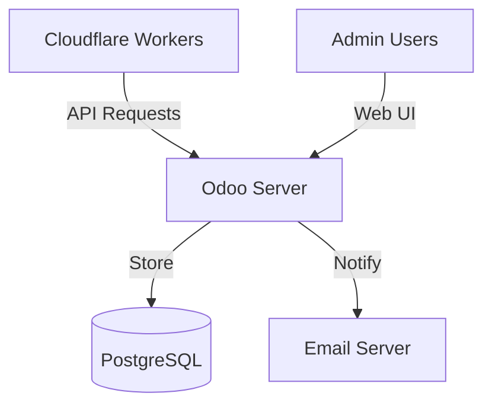

# Sunray Admin Server v3 Specification - Odoo 18 Addon

## 🎯 Overview

> **Prerequisites**: Read the [Sunray Introduction](../sunray_introduction.md) for core concepts and authentication flow.

The **Sunray Admin Server** is the `Admin Server` component implemented as an Odoo 18 addon. It provides the configuration management, user administration, and `Setup Token` generation described in the introduction. This specification covers the technical implementation details.

## 🏗️ Architecture



## 📦 Odoo Module Structure

### **Free Edition: `sunray_core`**
```
sunray_core/
├── __init__.py
├── __manifest__.py
├── models/
│   ├── __init__.py
│   ├── sunray_user.py
│   ├── sunray_passkey.py
│   ├── sunray_setup_token.py
│   ├── sunray_host.py
│   └── sunray_audit_log.py
├── controllers/
│   ├── __init__.py
│   └── api.py
├── views/
│   ├── sunray_user_views.xml
│   ├── sunray_host_views.xml
│   ├── sunray_menu.xml
│   └── sunray_dashboard.xml
├── wizards/
│   ├── __init__.py
│   └── setup_token_wizard.py
├── security/
│   ├── ir.model.access.csv
│   └── sunray_security.xml
├── data/
│   └── sunray_data.xml
└── static/
    └── description/
        └── icon.png
```

### **Advanced Edition: `sunray_advanced`** 
```
sunray_advanced/
├── __init__.py
├── __manifest__.py          # Depends: ['sunray_core']
├── models/
│   ├── __init__.py
│   ├── sunray_user.py       # Extend with advanced features
│   ├── sunray_license.py    # License management
│   ├── sunray_alert.py      # Security alerts
│   └── sunray_compliance.py # Compliance reporting
├── controllers/
│   ├── __init__.py
│   ├── advanced_api.py      # Advanced API endpoints
│   └── saml_controller.py   # SAML/OIDC integration
├── views/
│   ├── sunray_advanced_dashboard.xml
│   ├── sunray_security_views.xml
│   └── sunray_compliance_views.xml
├── wizards/
│   ├── __init__.py
│   ├── bulk_import_wizard.py
│   └── compliance_wizard.py
├── security/
│   ├── ir.model.access.csv
│   └── advanced_security.xml
├── data/
│   └── advanced_data.xml
└── static/
    └── description/
        └── icon.png
```

## 🗄️ Data Models

### sunray.user

```python
class SunrayUser(models.Model):
    _name = 'sunray.user'
    _description = 'Sunray User'
    _rec_name = 'username'
    
    username = fields.Char(string='Username', required=True, index=True)
    email = fields.Char(string='Email', required=True)
    display_name = fields.Char(string='Display Name')
    is_active = fields.Boolean(string='Active', default=True,
                              help='Deactivate to temporarily disable user access')
    
    # Relations
    passkey_ids = fields.One2many('sunray.passkey', 'user_id', string='Passkeys')
    setup_token_ids = fields.One2many('sunray.setup.token', 'user_id', string='Setup Tokens')
    host_ids = fields.Many2many('sunray.host', string='Authorized Hosts')
    
    # Computed fields
    passkey_count = fields.Integer(compute='_compute_passkey_count')
    last_login = fields.Datetime(compute='_compute_last_login')
    
    _sql_constraints = [
        ('username_unique', 'UNIQUE(username)', 'Username must be unique!')
    ]
```

### sunray.passkey

```python
class SunrayPasskey(models.Model):
    _name = 'sunray.passkey'
    _description = 'Sunray Passkey'
    
    user_id = fields.Many2one('sunray.user', required=True, ondelete='cascade')
    credential_id = fields.Char(string='Credential ID', required=True, index=True)
    public_key = fields.Text(string='Public Key', required=True)
    name = fields.Char(string='Device Name', required=True)
    last_used = fields.Datetime()
    backup_eligible = fields.Boolean(string='Backup Eligible')
    backup_state = fields.Boolean(string='Backup State')
    
    # Audit fields
    created_ip = fields.Char(string='Registration IP')
    created_user_agent = fields.Text(string='Registration User Agent')
    
    _sql_constraints = [
        ('credential_unique', 'UNIQUE(credential_id)', 'Credential ID must be unique!')
    ]
```

### sunray.setup.token

```python
class SunraySetupToken(models.Model):
    _name = 'sunray.setup.token'
    _description = 'Setup Token'
    
    user_id = fields.Many2one('sunray.user', required=True, ondelete='cascade')
    token_hash = fields.Char(string='Token Hash (SHA-512)', required=True)
    device_name = fields.Char(string='Device Name')
    expires_at = fields.Datetime(string='Expiration', required=True)
    consumed = fields.Boolean(default=False)
    consumed_date = fields.Datetime()
    
    # Constraints
    allowed_ips = fields.Text(string='Allowed IPs (JSON)', default='[]')
    max_uses = fields.Integer(default=1)
    current_uses = fields.Integer(default=0)
    
    # Generation info
    generated_by = fields.Many2one('res.users')
    
    @api.model
    def cleanup_expired(self):
        """Cron job to clean expired tokens"""
        expired_objs = self.search([
            ('expires_at', '<', fields.Datetime.now()),
            ('consumed', '=', False)
        ])
        expired_objs.unlink()
```

### sunray.host

```python
class SunrayHost(models.Model):
    _name = 'sunray.host'
    _description = 'Protected Host'
    
    domain = fields.Char(string='Domain', required=True, index=True)
    backend_url = fields.Char(string='Backend URL', required=True)
    is_active = fields.Boolean(string='Active', default=True,
                              help='Deactivate to temporarily disable host protection')
    
    # Security Exceptions (whitelist approach)
    # Default: Everything requires passkey authentication
    
    # CIDR-based exceptions (bypass all authentication)
    allowed_cidrs = fields.Text(string='Allowed CIDR Blocks (JSON)', 
                               default='[]',
                               help='CIDR blocks that bypass all authentication (e.g., office networks)')
    
    # URL-based public exceptions  
    public_url_patterns = fields.Text(string='Public URL Patterns (JSON)', 
                                     default='[]',
                                     help='URL regex patterns that allow unrestricted public access')
    
    # URL-based token exceptions
    token_url_patterns = fields.Text(string='Token-Protected URL Patterns (JSON)', 
                                    default='[]',
                                    help='URL regex patterns that accept token authentication instead of passkeys')
    
    # Webhook Authentication
    webhook_tokens = fields.One2many('sunray.webhook.token', 'host_id', string='Webhook Tokens')
    webhook_header_name = fields.Char(string='Webhook Header Name', default='X-Sunray-Webhook-Token')
    webhook_param_name = fields.Char(string='Webhook URL Parameter', default='sunray_token')
    
    # Access control  
    user_ids = fields.Many2many('sunray.user', string='Authorized Users')
    allowed_ips = fields.Text(string='Allowed IPs (JSON)', default='[]')
    
    # Session overrides
    session_duration_s = fields.Integer(string='Session Duration (seconds)',
                                        help='Session timeout in seconds. Examples:\n - 1h = 3600\n- 4h = 14400\n - 8h = 28800\n - 24h = 86400')
    
    _sql_constraints = [
        ('domain_unique', 'UNIQUE(domain)', 'Domain must be unique!')
    ]
    
    def _get_allowed_cidrs(self):
        """Parse allowed CIDR blocks from JSON"""
        return json.loads(self.allowed_cidrs or '[]')
    
    def _get_public_url_patterns(self):
        """Parse public URL patterns from JSON"""  
        return json.loads(self.public_url_patterns or '[]')
    
    def _get_token_url_patterns(self):
        """Parse token URL patterns from JSON"""
        return json.loads(self.token_url_patterns or '[]')
    
    def check_access_requirements(self, client_ip, url_path):
        """
        Determine access requirements for a request
        Security-first approach: Everything locked by default
        
        Returns:
        - 'cidr_allowed': IP is in allowed CIDR, bypass all auth
        - 'public': URL matches public pattern, no auth required  
        - 'token': URL matches token pattern, token auth required
        - 'passkey': Default - passkey authentication required
        """
        import ipaddress
        import re
        
        # 1. Check CIDR exceptions first (highest priority)
        if client_ip:
            try:
                client = ipaddress.ip_address(client_ip)
                for cidr_str in self._get_allowed_cidrs():
                    if client in ipaddress.ip_network(cidr_str, strict=False):
                        return 'cidr_allowed'
            except (ValueError, ipaddress.AddressValueError):
                # Invalid IP format, continue with other checks
                pass
        
        # 2. Check public URL exceptions
        for pattern in self._get_public_url_patterns():
            if re.match(pattern, url_path):
                return 'public'
        
        # 3. Check token URL exceptions  
        for pattern in self._get_token_url_patterns():
            if re.match(pattern, url_path):
                return 'token'
        
        # 4. Default: Require passkey authentication
        return 'passkey'
```

### sunray.webhook.token

```python
class SunrayWebhookToken(models.Model):
    _name = 'sunray.webhook.token'
    _description = 'Webhook Authentication Token'
    
    host_id = fields.Many2one('sunray.host', required=True, ondelete='cascade')
    name = fields.Char(string='Token Name', required=True)
    token = fields.Char(string='Token Value', required=True, index=True)
    is_active = fields.Boolean(string='Active', default=True,
                              help='Deactivate to temporarily disable token')
    last_used = fields.Datetime()
    usage_count = fields.Integer(default=0)
    
    # Optional restrictions
    allowed_ips = fields.Text(string='Allowed IPs (JSON)', default='[]')
    expires_at = fields.Datetime(string='Expiration Date')
    
    _sql_constraints = [
        ('token_unique', 'UNIQUE(token)', 'Token must be unique!')
    ]
    
    def generate_token(self):
        """Generate a secure random token"""
        import secrets
        import string
        alphabet = string.ascii_letters + string.digits
        self.token = ''.join(secrets.choice(alphabet) for _ in range(32))
    
    def is_valid(self, client_ip=None):
        """Check if token is valid and authorized"""
        if not self.active:
            return False
        
        if self.expires_at and self.expires_at < fields.Datetime.now():
            return False
        
        if client_ip and self.allowed_ips:
            allowed_ips = json.loads(self.allowed_ips or '[]')
            if allowed_ips and client_ip not in allowed_ips:
                return False
        
        return True
```

### sunray.audit.log

```python
class SunrayAuditLog(models.Model):
    _name = 'sunray.audit.log'
    _description = 'Audit Log'
    _order = 'timestamp desc'
    
    # Using dedicated timestamp field instead of create_date for indexing and ordering performance
    timestamp = fields.Datetime(default=fields.Datetime.now, index=True)
    event_type = fields.Selection([
        ('auth.success', 'Authentication Success'),
        ('auth.failure', 'Authentication Failure'),
        ('token.generated', 'Token Generated'),
        ('token.consumed', 'Token Consumed'),
        ('passkey.registered', 'Passkey Registered'),
        ('passkey.revoked', 'Passkey Revoked'),
        ('config.fetched', 'Config Fetched'),
    ], required=True)
    
    user_id = fields.Many2one('sunray.user')
    username = fields.Char()  # Store even if user deleted
    ip_address = fields.Char()
    user_agent = fields.Text()
    details = fields.Text()  # JSON field for extra data
    
    # Auto-cleanup old logs
    @api.model
    def cleanup_old_logs(self):
        """Keep last 90 days of logs"""
        cutoff = fields.Datetime.now() - timedelta(days=90)
        old_log_objs = self.search([('timestamp', '<', cutoff)])
        old_log_objs.unlink()
```

## 🔌 API Endpoints

### Authentication

All API endpoints require Bearer token authentication:

```python
def _authenticate_api(self, request):
    auth_header = request.httprequest.headers.get('Authorization', '')
    if not auth_header.startswith('Bearer '):
        return False
    
    token = auth_header[7:]
    # Validate against api.keys model
    api_key = request.env['api.key'].sudo().search([
        ('key', '=', token),
        ('active', '=', True)
    ])
    return bool(api_key)
```

### Configuration Endpoint

```python
@http.route('/sunray-srvr/v1/config', type='json', auth='none', methods=['GET'])
def get_config(self, **kwargs):
    if not self._authenticate_api(request):
        return {'error': 'Unauthorized'}, 401
    
    # Build configuration
    config = {
        'version': 3,
        'generated_at': fields.Datetime.now(),
        'users': {},
        'hosts': []
    }
    
    # Add users
    users = request.env['sunray.user'].sudo().search([('active', '=', True)])
    for user in users:
        config['users'][user.username] = {
            'email': user.email,
            'display_name': user.display_name,
            'created_at': user.created_date.isoformat(),
            'passkeys': []
        }
        
        # Add passkeys
        for passkey in user.passkey_ids:
            config['users'][user.username]['passkeys'].append({
                'credential_id': passkey.credential_id,
                'public_key': passkey.public_key,
                'name': passkey.name,
                'created_at': passkey.created_date.isoformat(),
                'backup_eligible': passkey.backup_eligible,
                'backup_state': passkey.backup_state
            })
    
    # Add hosts
    host_objs = request.env['sunray.host'].sudo().search([('is_active', '=', True)])
    for host_obj in host_objs:
        host_config = {
            'domain': host_obj.domain,
            'backend': host_obj.backend_url,
            'authorized_users': host_obj.user_ids.mapped('username'),
            'allowed_ips': json.loads(host_obj.allowed_ips or '[]'),
            'session_duration_override': host_obj.session_duration_s,
            
            # Security exceptions (whitelist approach)
            'allowed_cidrs': json.loads(host_obj.allowed_cidrs or '[]'),
            'public_url_patterns': json.loads(host_obj.public_url_patterns or '[]'),
            'token_url_patterns': json.loads(host_obj.token_url_patterns or '[]'),
            
            # Token authentication configuration
            'webhook_header_name': host_obj.webhook_header_name,
            'webhook_param_name': host_obj.webhook_param_name,
            'webhook_tokens': []
        }
        
        # Add active webhook tokens
        for token_obj in host_obj.webhook_tokens.filtered('is_active'):
            if token_obj.is_valid():
                host_config['webhook_tokens'].append({
                    'token': token_obj.token,
                    'name': token_obj.name,
                    'allowed_ips': json.loads(token_obj.allowed_ips or '[]'),
                    'expires_at': token_obj.expires_at.isoformat() if token_obj.expires_at else None
                })
        
        config['hosts'].append(host_config)
    
    return config
```

### Token Validation

```python
@http.route('/sunray-srvr/v1/setup-tokens/validate', type='json', auth='none', methods=['POST'])
def validate_token(self, username, token_hash, client_ip, **kwargs):
    if not self._authenticate_api(request):
        return {'error': 'Unauthorized'}, 401
    
    # Find user and token
    user_obj = request.env['sunray.user'].sudo().search([
        ('username', '=', username),
        ('is_active', '=', True)
    ])
    
    if not user_obj:
        return {'valid': False, 'error': 'User not found'}
    
    # Find matching token
    token_obj = request.env['sunray.setup.token'].sudo().search([
        ('user_id', '=', user_obj.id),
        ('token_hash', '=', token_hash),
        ('consumed', '=', False),
        ('expires_at', '>', fields.Datetime.now())
    ])
    
    if not token_obj:
        return {'valid': False, 'error': 'Invalid or expired token'}
    
    # Check constraints
    allowed_ips = json.loads(token_obj.allowed_ips or '[]')
    if allowed_ips and not self._check_ip_allowed(client_ip, allowed_ips):
        return {'valid': False, 'error': 'IP not allowed'}
    
    # Check usage limit
    if token_obj.current_uses >= token_obj.max_uses:
        return {'valid': False, 'error': 'Token usage limit exceeded'}
    
    # Mark as consumed
    token_obj.write({
        'current_uses': token_obj.current_uses + 1,
        'consumed': token_obj.current_uses + 1 >= token_obj.max_uses,
        'consumed_date': fields.Datetime.now()
    })
    
    # Log event
    request.env['sunray.audit.log'].sudo().create({
        'event_type': 'token.consumed',
        'user_id': user_obj.id,
        'username': username,
        'ip_address': client_ip,
        'details': json.dumps({'token_id': token_obj.id})
    })
    
    return {'valid': True, 'user': {
        'username': user_obj.username,
        'email': user_obj.email,
        'display_name': user_obj.display_name
    }}
```

### Passkey Registration

```python
@http.route('/sunray-srvr/v1/users/<string:username>/passkeys', type='json', auth='none', methods=['POST'])
def register_passkey(self, username, credential_id, public_key, name, client_ip, user_agent, **kwargs):
    if not self._authenticate_api(request):
        return {'error': 'Unauthorized'}, 401
    
    user = request.env['sunray.user'].sudo().search([('username', '=', username)])
    if not user:
        return {'error': 'User not found'}, 404
    
    # Create passkey
    passkey = request.env['sunray.passkey'].sudo().create({
        'user_id': user.id,
        'credential_id': credential_id,
        'public_key': public_key,
        'name': name,
        'created_ip': client_ip,
        'created_user_agent': user_agent,
        'backup_eligible': kwargs.get('backup_eligible', False),
        'backup_state': kwargs.get('backup_state', False)
    })
    
    # Log event
    request.env['sunray.audit.log'].sudo().create({
        'event_type': 'passkey.registered',
        'user_id': user.id,
        'username': username,
        'ip_address': client_ip,
        'user_agent': user_agent,
        'details': json.dumps({'passkey_id': passkey.id, 'name': name})
    })
    
    return {'success': True, 'passkey_id': passkey.id}
```

## 🖥️ Admin Interface

### Menu Structure

```xml
<!-- Main menu -->
<menuitem id="menu_sunray_root" 
          name="Sunray Admin" 
          web_icon="sunray_admin,static/description/icon.png"/>

<!-- Configuration -->
<menuitem id="menu_sunray_config" 
          name="Configuration" 
          parent="menu_sunray_root"/>
          
<menuitem id="menu_sunray_users" 
          name="Users" 
          parent="menu_sunray_config" 
          action="action_sunray_users"/>
          
<menuitem id="menu_sunray_hosts" 
          name="Protected Hosts" 
          parent="menu_sunray_config" 
          action="action_sunray_hosts"/>

<!-- Monitoring -->
<menuitem id="menu_sunray_monitoring" 
          name="Monitoring" 
          parent="menu_sunray_root"/>
          
<menuitem id="menu_sunray_audit" 
          name="Audit Logs" 
          parent="menu_sunray_monitoring" 
          action="action_sunray_audit_logs"/>
```

### User Management View

```xml
<!-- List View with filters -->
<record id="view_sunray_user_tree" model="ir.ui.view">
    <field name="name">sunray.user.tree</field>
    <field name="model">sunray.user</field>
    <field name="arch" type="xml">
        <tree>
            <field name="username"/>
            <field name="email"/>
            <field name="display_name"/>
            <field name="is_active" widget="boolean_toggle"/>
            <field name="passkey_count"/>
            <field name="last_login"/>
        </tree>
    </field>
</record>

<!-- Search View with filters -->
<record id="view_sunray_user_search" model="ir.ui.view">
    <field name="name">sunray.user.search</field>
    <field name="model">sunray.user</field>
    <field name="arch" type="xml">
        <search>
            <field name="username"/>
            <field name="email"/>
            <separator/>
            <filter name="active" string="Active" domain="[('is_active', '=', True)]" default="1"/>
            <filter name="inactive" string="Inactive" domain="[('is_active', '=', False)]"/>
            <separator/>
            <filter name="has_passkeys" string="Has Passkeys" domain="[('passkey_count', '>', 0)]"/>
            <group expand="0" string="Group By">
                <filter string="Status" name="group_by_status" context="{'group_by': 'is_active'}"/>
            </group>
        </search>
    </field>
</record>

<!-- Form View -->
<record id="view_sunray_user_form" model="ir.ui.view">
    <field name="name">sunray.user.form</field>
    <field name="model">sunray.user</field>
    <field name="arch" type="xml">
        <form>
            <header>
                <button name="generate_setup_token" 
                        string="Generate Setup Token" 
                        type="object" 
                        class="btn-primary"/>
            </header>
            <sheet>
                <group>
                    <group>
                        <field name="username"/>
                        <field name="email"/>
                        <field name="display_name"/>
                    </group>
                    <group>
                        <field name="is_active" widget="boolean_toggle"/>
                        <field name="create_date" readonly="1"/>
                        <field name="last_login" readonly="1"/>
                        <field name="passkey_count" readonly="1"/>
                    </group>
                </group>
                
                <notebook>
                    <page string="Passkeys">
                        <field name="passkey_ids">
                            <tree editable="bottom">
                                <field name="name"/>
                                <field name="create_date"/>
                                <field name="last_used"/>
                                <field name="backup_state"/>
                                <button name="revoke" string="Revoke" type="object" icon="fa-trash"/>
                            </tree>
                        </field>
                    </page>
                    
                    <page string="Setup Tokens">
                        <field name="setup_token_ids" readonly="1">
                            <tree>
                                <field name="device_name"/>
                                <field name="expires_at"/>
                                <field name="consumed"/>
                                <field name="generated_by"/>
                            </tree>
                        </field>
                    </page>
                    
                    <page string="Authorized Hosts">
                        <field name="host_ids" widget="many2many_tags"/>
                    </page>
                </notebook>
            </sheet>
        </form>
    </field>
</record>
```

### Setup Token Wizard

```python
class SetupTokenWizard(models.TransientModel):
    _name = 'sunray.setup.token.wizard'
    _description = 'Generate Setup Token'
    
    user_id = fields.Many2one('sunray.user', required=True)
    device_name = fields.Char(string='Device Name', required=True)
    validity_hours = fields.Integer(string='Valid for (hours)', default=24)
    allowed_ips = fields.Text(string='Allowed IPs (one per line)')
    
    def generate_token(self):
        # Generate secure token
        token = secrets.token_urlsafe(32)
        token_hash = hashlib.sha512(token.encode()).hexdigest()
        
        # Parse allowed IPs
        ip_list = []
        if self.allowed_ips:
            ip_list = [ip.strip() for ip in self.allowed_ips.splitlines() if ip.strip()]
        
        # Create token record
        setup_token_obj = self.env['sunray.setup.token'].create({
            'user_id': self.user_id.id,
            'token_hash': f'sha512:{token_hash}',
            'device_name': self.device_name,
            'expires_at': fields.Datetime.now() + timedelta(hours=self.validity_hours),
            'allowed_ips': json.dumps(ip_list),
            'generated_by': self.env.user.id
        })
        
        # Log event
        self.env['sunray.audit.log'].create({
            'event_type': 'token.generated',
            'user_id': self.user_id.id,
            'username': self.user_id.username,
            'details': json.dumps({
                'device_name': self.device_name,
                'validity_hours': self.validity_hours
            })
        })
        
        # Show token to admin
        return {
            'type': 'ir.actions.act_window',
            'name': 'Setup Token Generated',
            'view_mode': 'form',
            'res_model': 'sunray.token.display.wizard',
            'target': 'new',
            'context': {
                'default_token': token,
                'default_username': self.user_id.username,
                'default_expires_at': setup_token.expires_at
            }
        }
```

## 🔧 Installation & Configuration

### Module Installation

1. Copy module to Odoo addons path
2. Update apps list
3. Install "Sunray Admin Server" module
4. Configure API access

### Initial Setup

```python
# Create API key for Workers
api_key = env['api.key'].create({
    'name': 'Cloudflare Workers',
    'key': secrets.token_urlsafe(32),
    'active': True
})

# Create admin user
admin = env['res.users'].create({
    'name': 'Sunray Admin',
    'login': 'sunray_admin',
    'groups_id': [(4, env.ref('sunray_admin.group_sunray_admin').id)]
})
```

### Security Groups

```xml
<record id="group_sunray_user" model="res.groups">
    <field name="name">Sunray User</field>
    <field name="category_id" ref="module_category_sunray"/>
</record>

<record id="group_sunray_admin" model="res.groups">
    <field name="name">Sunray Administrator</field>
    <field name="category_id" ref="module_category_sunray"/>
    <field name="implied_ids" eval="[(4, ref('group_sunray_user'))]"/>
    <field name="users" eval="[(4, ref('base.user_root'))]"/>
</record>
```

## 📊 Dashboard

### Free Edition Dashboard

**Key Metrics:**
- Active users count
- Total passkeys registered
- Pending setup tokens  
- Authentication success rate (last 24h)
- Most active domains

**Recent Activity Feed:**
- Last 10 authentication attempts
- Recent passkey registrations
- Setup token generations
- Configuration fetches

### Advanced Edition Dashboard

**Enhanced Metrics:**
- All free edition metrics plus:
- Security alerts count (last 7 days)
- Risk score distribution
- Device trust level breakdown
- Geographic access patterns
- Compliance score

**Advanced Widgets:**
- Real-time security threat map
- Authentication patterns chart
- Device trust level trends
- Failed login attempt analysis
- Compliance status indicators

**Alerts Panel:**
- High-risk authentication attempts
- Suspicious device registrations
- Compliance violations
- License expiration warnings

## 🔄 Scheduled Actions

### Free Edition Cron Jobs

```xml
<record id="ir_cron_cleanup_expired_tokens" model="ir.cron">
    <field name="name">Sunray: Cleanup Expired Tokens</field>
    <field name="model_id" ref="model_sunray_setup_token"/>
    <field name="state">code</field>
    <field name="code">model.cleanup_expired()</field>
    <field name="interval_number">1</field>
    <field name="interval_type">days</field>
</record>

<record id="ir_cron_cleanup_old_logs" model="ir.cron">
    <field name="name">Sunray: Cleanup Old Audit Logs</field>
    <field name="model_id" ref="model_sunray_audit_log"/>
    <field name="state">code</field>
    <field name="code">model.cleanup_old_logs()</field>
    <field name="interval_number">1</field>
    <field name="interval_type">days</field>
</record>
```

### Advanced Edition Cron Jobs

```xml
<!-- Device cleanup (Advanced only) -->
<record id="ir_cron_cleanup_inactive_devices" model="ir.cron">
    <field name="name">Sunray Advanced: Cleanup Inactive Devices</field>
    <field name="model_id" ref="model_sunray_passkey"/>
    <field name="state">code</field>
    <field name="code">model.cleanup_inactive_devices()</field>
    <field name="interval_number">1</field>
    <field name="interval_type">weeks</field>
    <field name="groups_id" eval="[(4, ref('sunray_admin.group_sunray_advanced'))]"/>
</record>

<!-- Security monitoring (Advanced only) -->
<record id="ir_cron_security_monitoring" model="ir.cron">
    <field name="name">Sunray Advanced: Security Monitoring</field>
    <field name="model_id" ref="model_sunray_audit_log"/>
    <field name="state">code</field>
    <field name="code">model.detect_security_threats()</field>
    <field name="interval_number">15</field>
    <field name="interval_type">minutes</field>
    <field name="groups_id" eval="[(4, ref('sunray_admin.group_sunray_advanced'))]"/>
</record>

<!-- Compliance reporting (Advanced only) -->
<record id="ir_cron_compliance_reports" model="ir.cron">
    <field name="name">Sunray Advanced: Weekly Compliance Report</field>
    <field name="model_id" ref="model_sunray_audit_log"/>
    <field name="state">code</field>
    <field name="code">model.generate_weekly_compliance_report()</field>
    <field name="interval_number">1</field>
    <field name="interval_type">weeks</field>
    <field name="groups_id" eval="[(4, ref('sunray_admin.group_sunray_advanced'))]"/>
</record>

<!-- License validation (Advanced only) -->
<record id="ir_cron_license_check" model="ir.cron">
    <field name="name">Sunray Advanced: License Validation</field>
    <field name="model_id" ref="model_sunray_config"/>
    <field name="state">code</field>
    <field name="code">model.validate_license_status()</field>
    <field name="interval_number">1</field>
    <field name="interval_type">days</field>
    <field name="groups_id" eval="[(4, ref('sunray_admin.group_sunray_advanced'))]"/>
</record>
```

## 📋 Feature Comparison

| Feature | Sunray Core | Sunray Advanced |
|---------|---------------|------------------|
| **User Management** |
| Users & Devices | ✅ | ✅ |
| Setup Token Generation | ✅ Manual | ✅ Automated |
| Token Delivery | 📋 Copy/Paste | 📧 Email + SMS |
| Bulk Operations | ❌ | ✅ CSV Import/Export |
| Self-Service Portal | ❌ | ✅ |
| **Security & Compliance** |
| Audit Logging | ✅ | ✅ |
| Security Alerts | ❌ | ✅ |
| Compliance Reports | ❌ | ✅ |
| **Operations** |
| Admin Users | ✅ | ✅ + Roles |
| Monitoring | 📊 Basic | 📈 Advanced |
| **Integrations** |
| API Access | ✅ Read-only | ✅ Full API |
| SAML/OIDC | ❌ | ✅ |
| HR System Sync | ❌ | ✅ |
| Slack/Teams | ❌ | ✅ |

## 🚀 Deployment Considerations

### Performance

- Index all lookup fields (username, credential_id, domain)
- Cache configuration responses when possible
- Use database connection pooling
- Enable Odoo's multi-worker mode

### License Management (Advanced)

- Validate license keys on startup
- Monitor user count against license limits
- Graceful degradation when license expires
- Automated renewal notifications

### Backup

**Free Edition:**
- Regular PostgreSQL backups
- Export configuration to YAML periodically
- 90-day audit log retention

**Advanced Edition:**
- All free features plus:
- Automated backup verification
- Compliance-ready log archival
- 1-year audit log retention
- Encrypted backup storage

### High Availability

- Deploy Odoo in multi-server configuration
- Use PostgreSQL replication
- Load balancer for API endpoints
- Consider read replicas for config fetches
- Advanced: Multi-region deployment support